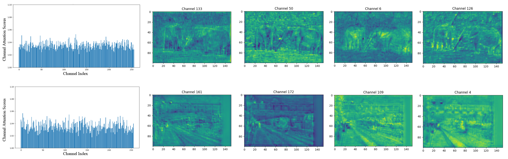
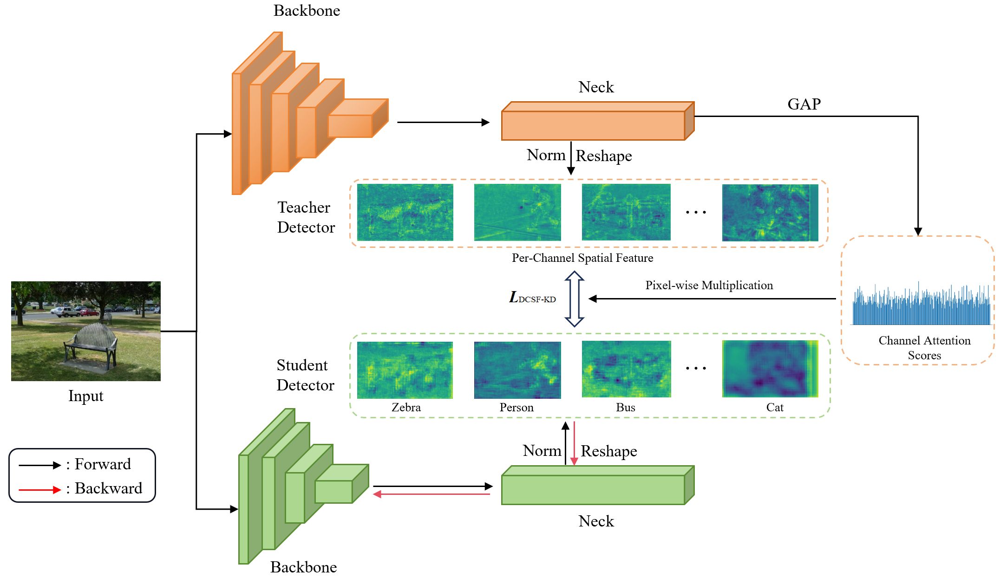

# DCSF-KD: Dynamic Channel-wise Spatial Feature Knowledge Distillation for Object Detection

     
     
    <strong>Figure 1:</strong> The four visualized channel images represent the scenarios of the smallest weight, the second smallest weight, the second largest weight, and the largest weight, respectively.

     
     
    <strong>Figure 2:</strong> Overall Framework of DCSF-KD.

You can see what you need in https://github.com/LinY-ct/DCSF-KD/tree/master/configs/distill/mmdet/dcsfkd and  

https://github.com/LinY-ct/DCSF-KD/tree/master/mmrazor/models/losses/dcsfkd_loss.py 

## License

This project is released under the [Apache 2.0 license](https://github.com/LinY-ct/DCSF-KD/blob/main/LICENSE).

## Acknowledgements

Our gratitude extends to the authors of the following repositories for their foundational model implementations:

- [MMDetection](https://github.com/open-mmlab/mmdetection)
- [PKD](https://github.com/open-mmlab/mmrazor)
- [CrossKD](https://github.com/jbwang1997/CrossKD)

